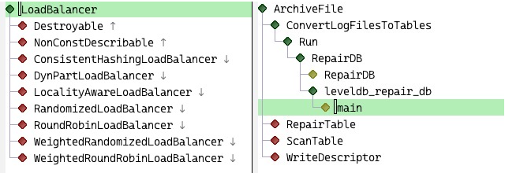

# M-x Eglot hierarchy

## Usage

Currently, there are two interactive commands available you can use to
generate type and call hierarchy.

* `M-x eglot-hierarchy-type-hierarchy`

* `M-x eglot-hierarchy-call-hierarchy`
 
That's it.

## Installation

If you are using Emacs 29.1, execute the following command:

`(package-vc-install "https://github.com/dolmens/eglot-hierarchy")`

Alternatively, you can download the `eglot-hierarchy.el` file and
load it somehow.
